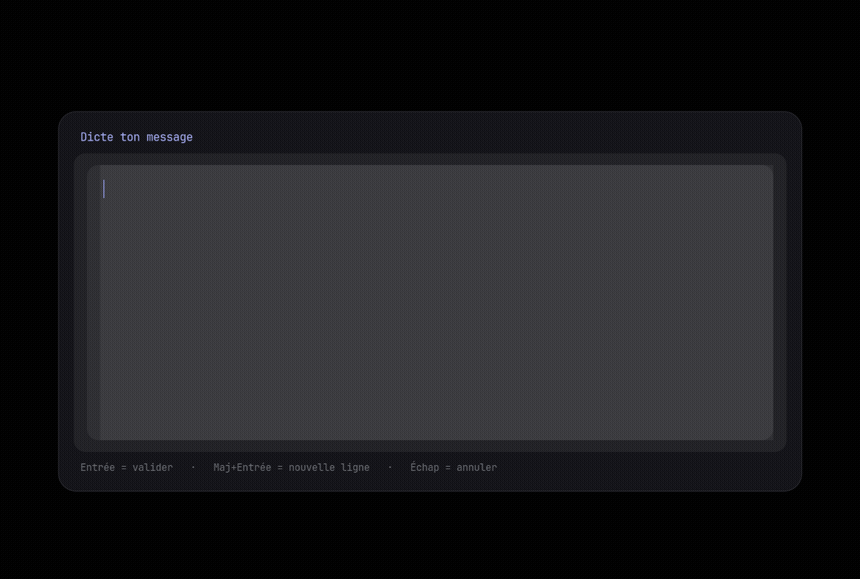
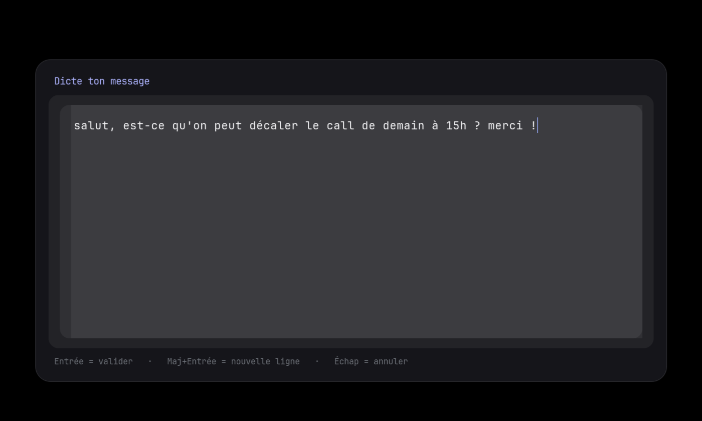
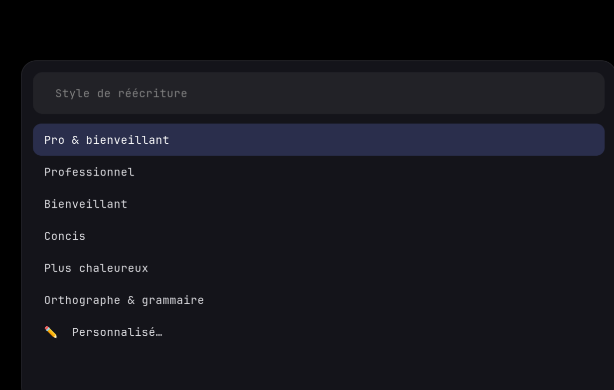

<div align="center">


# friendly

**Dictate or type a rough message, pick a tone, get a polished rewrite on your clipboard.**

A tiny Spotlight-style overlay for Wayland that rewrites your text in a chosen
tone — professional, kind, concise… — using [Claude Code](https://www.anthropic.com/claude-code)
(`claude -p`), then copies the result. Built for a voice-dictation workflow on
Arch + Sway.

[](LICENSE)
[](https://aur.archlinux.org/packages/friendly)


</div>

<p align="center">
  
</p>

<p align="center">
  <em>One hotkey: the box opens and dictation auto-starts; speak, pick a tone, paste the rewrite.</em>
</p>

<p align="center">
  
  
</p>

## Why

You dictate a quick, messy message with your voice — *"yo can we push the call to 3pm, thx"* —
and want a clean version to paste into Slack / email / wherever, in the right tone,
without leaving the keyboard. `friendly` is the glue: a centered text box you dictate
into, a tone picker, and the rewrite lands in your clipboard. The thinking is done by
Claude Code; `friendly` just handles the UI and the clipboard.

## How it works

```
  hotkey ──▶ ┌──────────────────────────┐
             │  centered text area      │   GTK layer-shell overlay (friendly-input.py),
             │  (dictate / type)        │   focus ready — your dictation tool types in it
             └────────────┬─────────────┘
                          │ Enter
             ┌──────────────────────────┐
             │  tone menu (wofi)        │   Professional · Kind · Concise · … · ✏️ Custom
             └────────────┬─────────────┘
                          │
              claude -p ──▶  rewritten text  ──▶  📋 clipboard  +  🔔 notification
```

- **Input** — a multiline text area rendered as a centered `wlr-layer-shell` overlay
  (so it's never tiled by your compositor). `Enter` submits, `Shift+Enter` adds a
  newline, `Esc` cancels.
- **Tone** — a `wofi` Spotlight bar lists presets plus a free-form *Custom…* option.
- **Rewrite** — the message + tone are sent to **`claude -p`** (Claude Code's
  non-interactive mode). It uses your existing Claude Code login — no API key to
  manage. The model is told to return *only* the rewritten text.
- **Output** — the result is copied with `wl-copy` and shown in a notification.

> [!NOTE]
> The rewrite runs in the cloud: your text is sent to Anthropic over HTTPS for the
> duration of the request. Keep that in mind for sensitive content. No network → no
> rewrite (the model is remote).

## Install

### From the AUR (recommended)

```bash
# stable
paru -S friendly        # or: yay -S friendly
# or bleeding-edge (builds from git HEAD)
paru -S friendly-git
```

You also need **Claude Code** logged in (`claude`):

```bash
paru -S claude-code      # or: npm i -g @anthropic-ai/claude-code
claude        # run once to authenticate
```

### Debian / Ubuntu

Grab the `.deb` from the [latest release](https://github.com/KannarFr/friendly/releases/latest):

```bash
sudo apt install ./friendly_*_all.deb
# Claude Code is not in Debian/Ubuntu — install it separately:
npm install -g @anthropic-ai/claude-code && claude
```

Build it yourself from a checkout: `cp -r packaging/debian debian && dpkg-buildpackage -b -us -uc`.

### Exherbo

Drop [`packaging/exherbo/friendly.exheres-0`](packaging/exherbo/) into a repository
you own, then `cave resolve -x friendly`. See
[`packaging/exherbo/README.md`](packaging/exherbo/README.md) (verify the dependency
atoms — gtk-layer-shell/wofi may need a personal repo).

### Manual

```bash
git clone https://github.com/KannarFr/friendly
cd friendly
mkdir -p ~/.local/bin ~/.local/share/friendly ~/.local/share/icons/hicolor/scalable/apps ~/.local/share/applications
ln -sf "$PWD/friendly" ~/.local/bin/friendly
cp friendly-input.py spotlight.css friendly.svg ~/.local/share/friendly/
cp friendly.svg ~/.local/share/icons/hicolor/scalable/apps/friendly.svg
ln -sf "$PWD/friendly.desktop" ~/.local/share/applications/friendly.desktop
```

The script finds its resources next to itself **or** in `~/.local/share/friendly`,
`/usr/share/friendly`, etc., so both layouts work.

### macOS / X11

Not supported. The UI is Wayland-only — the centered overlay needs
`wlr-layer-shell` (via `gtk-layer-shell`), the menu uses `wofi`, and the clipboard
uses `wl-copy`. Only `claude -p` is cross-platform. A macOS port would mean
replacing the UI layer (e.g. a native SwiftUI panel or Hammerspoon/Raycast) and
using `pbcopy`; the rewrite logic and prompt would carry over unchanged. Not
planned — open an issue if you want to drive it.

## Bind a key

**Sway** — use an absolute path (Sway's `PATH` may not include `~/.local/bin`):

```
bindsym $mod+y exec /usr/bin/friendly
```

**Hyprland** (`hyprland.conf`):

```
bind = $mainMod, Y, exec, friendly
```

**GNOME** — *Settings → Keyboard → Custom Shortcuts* → command `friendly`.

## Dictation

`friendly` doesn't transcribe — it takes whatever you type into its text area. Pair it
with any tool that types into the focused window, e.g.
[Handy](https://github.com/cjpais/Handy) or
[nerd-dictation](https://github.com/ideasman42/nerd-dictation).

To **auto-start dictation when the box opens** (so one hotkey does both), pass
`--on-open CMD` — it runs `CMD` once the window is focused. With Handy on Sway:

```
bindsym $mod+y exec /usr/bin/friendly --on-open 'handy --toggle-transcription'
```

Now `$mod+y` opens the box and starts recording; speak, stop your dictation (Handy
types the text into the box), then `Enter`. You can also set it globally with the
`FRIENDLY_ON_OPEN` environment variable instead of the flag.

## Usage

GUI:

```bash
friendly
```

CLI / scriptable:

```bash
friendly -s "Professionnel" "mon texte"      # preset by name
friendly -i "a very formal tone" "my text"   # free-form instruction
echo "mon texte" | friendly -s Concis -n     # from a pipe, result on stdout
```

> The UI strings and the default presets ship in **French** (see the screenshots).
> Everything is editable — rename/translate the presets in `presets.conf`.

| Flag | Meaning |
| --- | --- |
| `-s, --style NAME` | use a preset by name (skip the menu) |
| `-i, --instruction TEXT` | free-form tone instruction (skip the menu) |
| `-o, --on-open CMD` | run `CMD` when the box opens (e.g. start dictation); env: `FRIENDLY_ON_OPEN` |
| `-n, --no-copy` | print the result to stdout instead of copying |
| `-h, --help` | help |

`Esc` at any step cancels cleanly (exit 0, nothing copied).

## Configuration

**Tones** live in `~/.config/friendly/presets.conf` (created on first run). One per
line, `Display name|instruction sent to the model` (ships in French, editable).
The **first** preset is the default — it's highlighted in the menu, so just pressing
`Enter` picks it:

```
Pro & bienveillant|un ton à la fois professionnel, bienveillant et posé
Professionnel|un ton professionnel, clair et posé
Concis|une formulation plus concise et directe, sans perdre l'essentiel
```

**Look** — tweak `spotlight.css` (the `wofi` bars) and the inline CSS in
`friendly-input.py` (the text area): colors, radius, font size, width.

## Dependencies

All in the official Arch repos except Claude Code:

| Package | Role |
| --- | --- |
| `claude-code` *(AUR / npm)* | the LLM backend — `claude -p` (**required**) |
| `python` + `python-gobject` + `gtk-layer-shell` + `gtk3` | the centered text area |
| `wl-clipboard` | clipboard (`wl-copy`) |
| `wofi` | tone menu *(falls back to `rofi`, then `zenity`)* |
| `libnotify` | notifications *(optional but recommended)* |

## Packaging / releasing

See [`packaging/README.md`](packaging/README.md). TL;DR: push a `vX.Y.Z` tag and CI
creates the GitHub Release and auto-publishes the `friendly` AUR package.

## License

[MIT](LICENSE) © 2026 KannarFr
